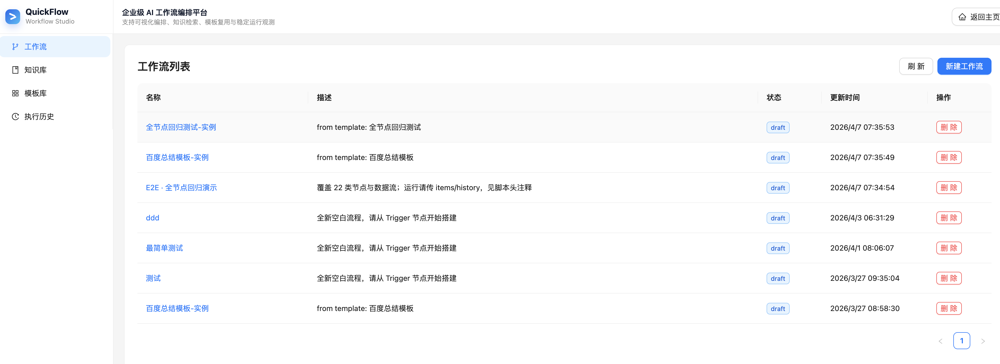
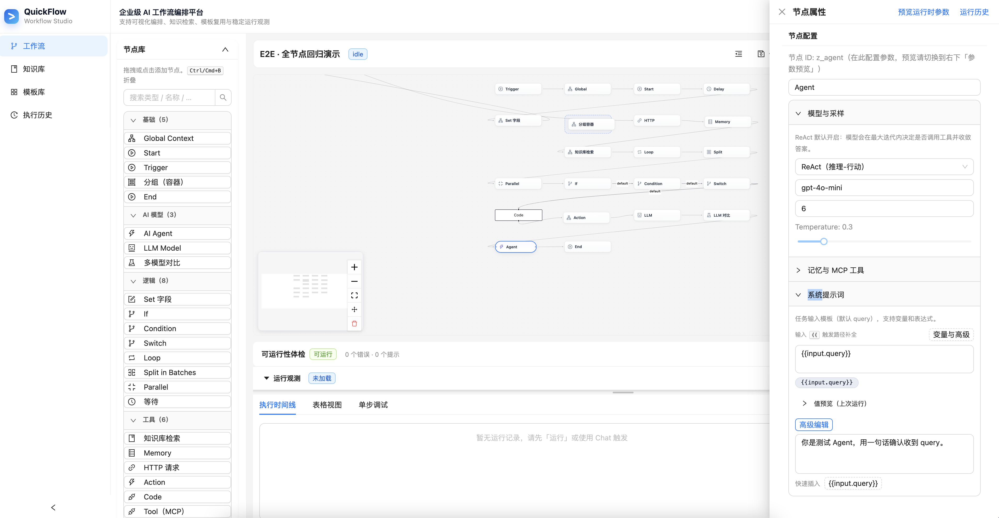
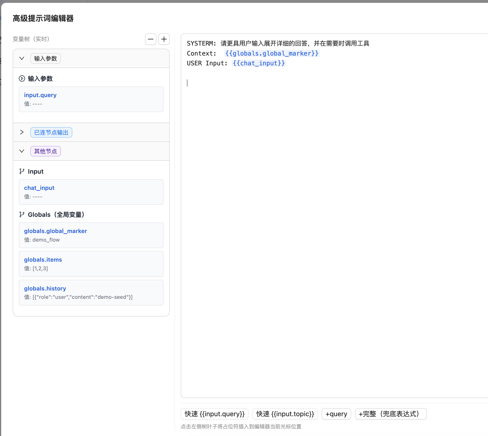
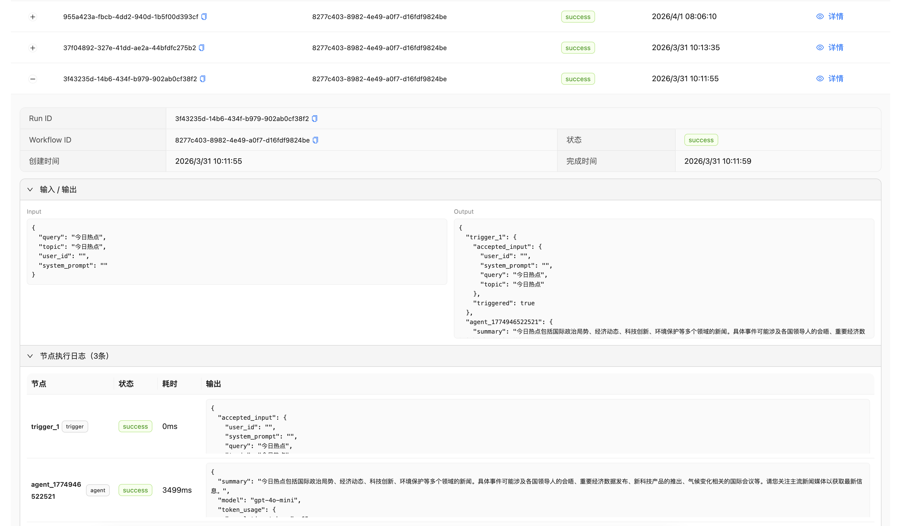
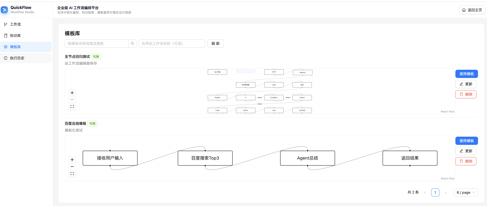
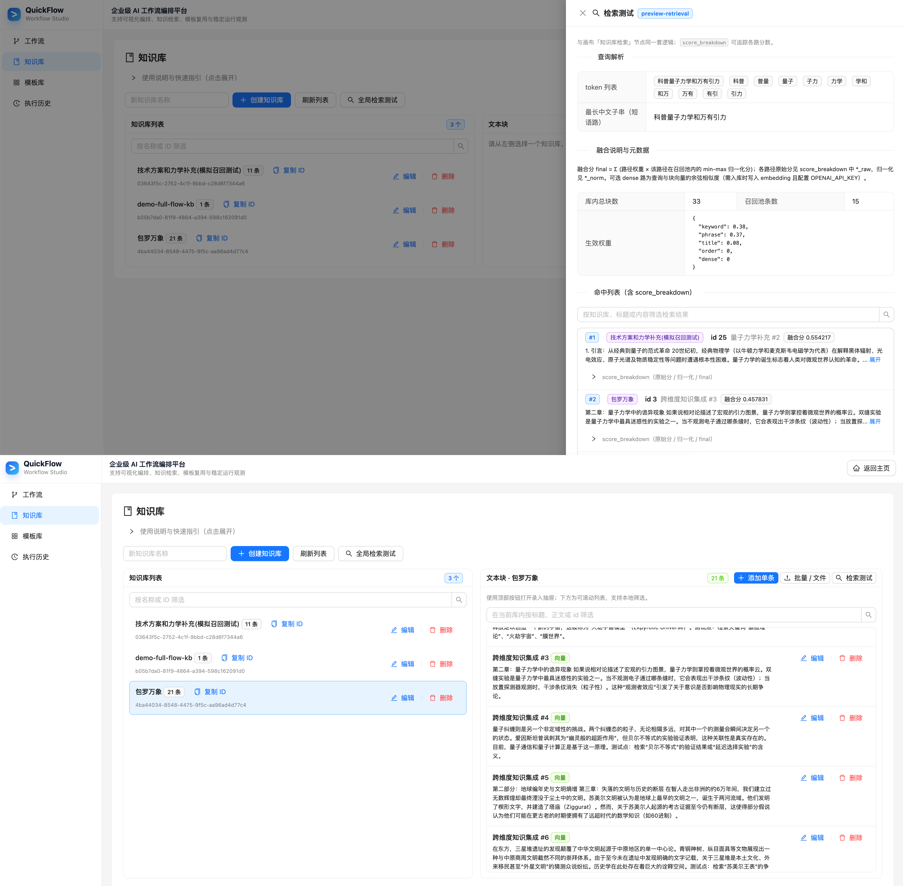

# QuickAgentFlow

QuickAgentFlow 是一个面向生产落地的 Agent 工作流平台，提供从流程编排、运行触发到执行观测的端到端闭环能力，目标形态接近 n8n / Dify 风格。

## 项目定位

- 面向团队内部和业务场景的可视化 Agent 编排平台
- 强调真实可用链路：UI 操作 -> API 调用 -> DB 持久化 -> 执行结果可观测
- 支持低门槛上手与后续可扩展的节点生态


## 功能页面展示

### 1) 工作流列表

### 2) 工作流编辑器主画布

### 3) 参数动态引用


### 4) 执行历史页面


### 5) 模板页面


### 6) 知识库页面(可在线观测)



## 后端设计概览

后端采用 `FastAPI + SQLModel + Pydantic`，按 `API -> Service -> Repository -> Model` 分层组织，并将工作流执行引擎独立在 `engine` 模块中。

- **API 层**：提供 `workflows`、`runs`、`node-types`、`templates`、`knowledge`、`mcp` 等稳定接口
- **Service 层**：编排业务流程，处理运行状态、日志写入、SSE 流式事件组装
- **Repository 层**：专注 ORM 持久化和查询，不混入复杂业务决策
- **执行引擎**：支持流式运行、单步调试、断点续跑，执行前统一图校验
- **可观测性**：同时记录 `run_logs`（节点级）与 `run_trace`（细粒度 phase 级）数据

## Agent 设计实现

QuickAgentSilva 的 Agent 不是单点问答，而是被建模为“可编排、可追踪、可恢复”的工作流执行单元。

- **Agent 编排模型**：Agent 以节点形式进入工作流图，与 LLM、Tool、HTTP、RAG 等节点统一调度
- **Agent 运行状态**：每次触发都生成独立 run，完整记录 `created -> running -> success/failed` 生命周期
- **Agent 流式交互**：通过 `/api/workflows/{id}/chat/stream` 让前端实时接收节点事件与最终输出
- **Agent 可恢复执行**：通过 `/api/workflows/{id}/resume/stream` 从指定节点续跑，支持调试与人工干预场景
- **Agent 可观测调试**：节点日志（输入/输出/耗时）+ 结构化 trace（phase/meta）双轨数据，便于定位工具调用或检索链路问题

详细说明请见：[后端架构详解](docs/backend-architecture.md)

## 功能清单
- 可视化工作流编辑器（节点拖拽、连线、缩放平移、多选删除）
- 运行触发能力（表单运行 + 聊天流式运行）
- 执行历史与日志回放（历史筛选、节点日志、trace 轨迹）
- 模板能力闭环（保存模板、模板列表、应用模板创建新流程）
- 知识库管理与检索预览（分块管理、检索调参、效果验证）

完整清单请见：[功能清单与页面截图位](docs/feature-checklist.md)

## 项目优势

- **后端分层清晰**：接口、业务、存储职责分离，迭代和维护成本可控
- **执行反馈实时**：SSE 流式输出节点事件，便于运行中调试与体验优化
- **观测数据完整**：日志与结构化 trace 双轨记录，定位问题更快
- **前后端契约稳定**：节点目录与工具目录由后端动态下发，避免前端硬编码
- **扩展友好**：节点类型、工具接入、执行策略均可增量扩展
- **Agent 工程化落地**：支持运行态管理、断点续跑和历史回放，不停留在演示级对话

## 部署启动快速指导

以下步骤用于本地快速启动（开发模式），默认后端端口 `8001`、前端端口 `5174`。

### 1) 启动后端（FastAPI）

```bash
cd backend
python3 -m venv .venv
source .venv/bin/activate
pip install -r requirements.txt
uvicorn app.main:app --host 0.0.0.0 --port 8001 --reload
```

后端健康检查地址：`http://localhost:8001/health`

### 2) 启动前端（Vite + React）

```bash
cd frontend
npm install
npm run dev -- --host 0.0.0.0 --port 5174
```

前端访问地址：`http://localhost:5174`

### 3) 最小联调检查

- 打开前端后进入工作流页面，创建一个新工作流并保存
- 在编辑器中通过“运行”或“聊天触发”发起一次执行
- 在历史或日志面板确认有 run 记录、节点日志和最终状态

### 4) 生产部署建议（简版）

- 后端：建议使用 `gunicorn + uvicorn workers` 或容器化部署
- 前端：执行 `npm run build` 后由 Nginx/静态资源服务托管
- 数据库：开发默认 SQLite，生产建议切换为托管数据库并配套迁移流程
