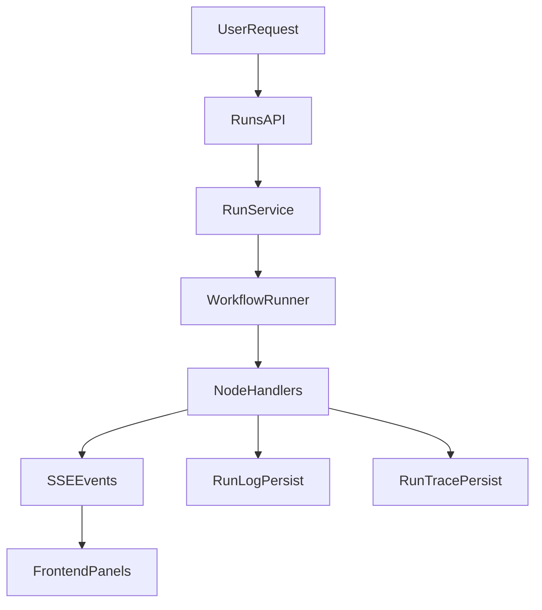

# QuickAgentSilva 后端架构详解

本文聚焦 QuickAgentSilva 后端实现，说明分层设计、核心 API、执行链路与可观测方案，便于研发协作和后续扩展。

## 1. 技术栈与分层

- Web 框架：`FastAPI`
- 数据模型：`SQLModel` + `Pydantic`
- 持久化：ORM 模型 + Repository
- 执行引擎：`engine` 模块（运行时、节点处理、图校验）

后端核心分层如下：

- `api`：路由定义与参数协议
- `services`：业务编排和流程控制
- `repositories`：数据库读写与查询
- `models`：实体定义（workflow、run、template、knowledge、trace）
- `engine`：工作流执行与节点运行时

## 2. API 设计（稳定能力面）

在 `backend/app/api/router.py` 中统一挂载路由，包含以下核心域：

- `workflows`：工作流 CRUD、图结构保存与校验
- `runs`：运行创建、运行历史、日志与 trace 查询、流式执行
- `node-types`：节点目录及配置 schema 下发
- `templates`：模板管理和模板应用
- `knowledge`：知识库与检索相关 API
- `mcp`：工具目录与健康检查
- `expressions`：表达式相关能力

该设计让前端编辑器可以依赖后端动态能力，不需要硬编码节点/工具清单。

## 3. 执行链路（Run Lifecycle）

典型流式运行链路：

1. 前端调用 `/api/workflows/{workflow_id}/chat/stream`
2. `RunService.stream_run()` 创建 run 并设置为 `running`
3. 运行器逐节点执行，持续产出 `node_start` / `node_end` / `done` / `error`
4. 节点结束时写入 `run_logs`，并按批次 flush `run_trace`
5. 执行结束后更新 run 状态为 `success` 或 `failed`

## 4. Agent 设计与实现

QuickAgentSilva 将 Agent 能力落在“图编排 + 运行态 + 可观测”三件事上，而不是仅实现单一对话接口。

### 4.1 Agent 运行单元

- Agent 由工作流图中的节点组合驱动，运行入口统一由 `runs` API 管理
- 每次 Agent 触发都会创建独立 run，run 状态由 `RunService` 控制并落库
- 运行时支持普通触发、流式触发、断点续跑和单步调试四类路径

### 4.2 Agent 编排执行

- 执行前通过 `validate_for_execution` 校验图结构与配置合法性
- `WorkflowRunner` 负责将图编排转化为节点级执行事件
- 节点结束时写入日志，确保 Agent 的每一步都有可回放记录

### 4.3 Agent 可观测性

- 节点日志层：记录每个节点的输入、输出、耗时和状态
- 轨迹事件层：记录更细粒度 phase（如工具调用、检索阶段）的结构化事件
- SSE 实时层：把执行过程持续推送给前端，支持运行中观察和调试

该设计使 Agent 具备工程化运行能力：可追踪、可诊断、可恢复。

## 5. 流式执行与事件模型

后端通过 `StreamingResponse` 输出 `text/event-stream`，前端可实时消费执行事件。

- 事件类型：`node_start`、`node_end`、`done`、`error`、`trace`
- 响应格式：`data: <json>\n\n`
- 核心接口：
  - `/api/workflows/{workflow_id}/chat/stream`
  - `/api/workflows/{workflow_id}/resume/stream`

`trace` 事件用于补充节点日志之外的细粒度阶段信息（如工具调用、检索步骤），提升排障效率。

## 6. 可观测设计

后端采用双层可观测数据：

- `RunLog`：节点粒度日志
  - 节点输入/输出
  - 节点状态（success/failed）
  - 节点耗时
- `RunTraceEntry`：执行阶段粒度轨迹
  - 事件序号
  - 阶段标识（phase）
  - 结构化 meta

这种组合可同时覆盖“业务视角日志”和“技术视角链路追踪”。

## 7. 扩展性设计要点

- 节点能力由后端目录动态下发，支持前端低耦合扩展
- 执行器支持多运行时策略（LangGraph/Legacy），便于平滑演进
- 执行前统一图校验，减少运行时低级错误
- Service/Repository 分层轻量，易于新增业务域

## 8. 当前边界与演进方向

基于现有代码，以下能力可作为后续演进重点：

- `parallel` 节点仍为占位能力，可补全并行分支调度
- `code` 节点尚未开启，可补充沙箱执行体系
- 数据库迁移当前较轻，可引入版本化迁移链路

返回主文档：[README](../README.md)
